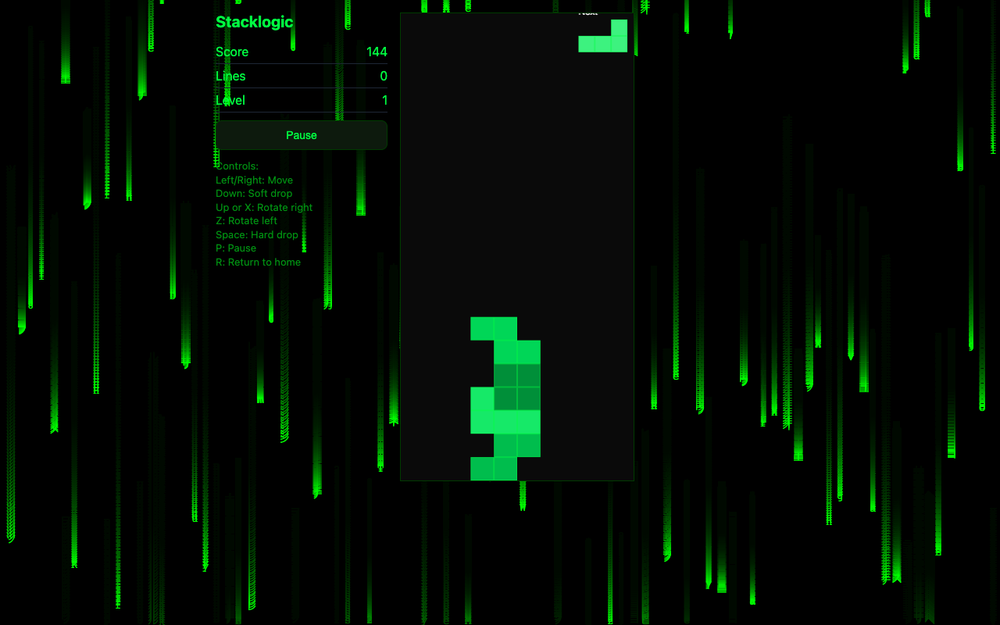
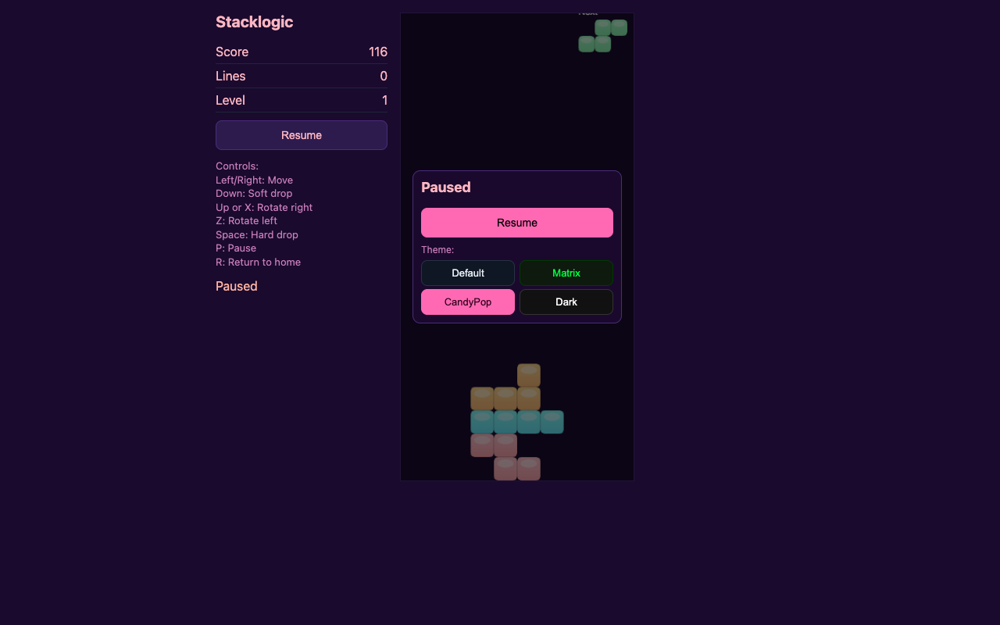
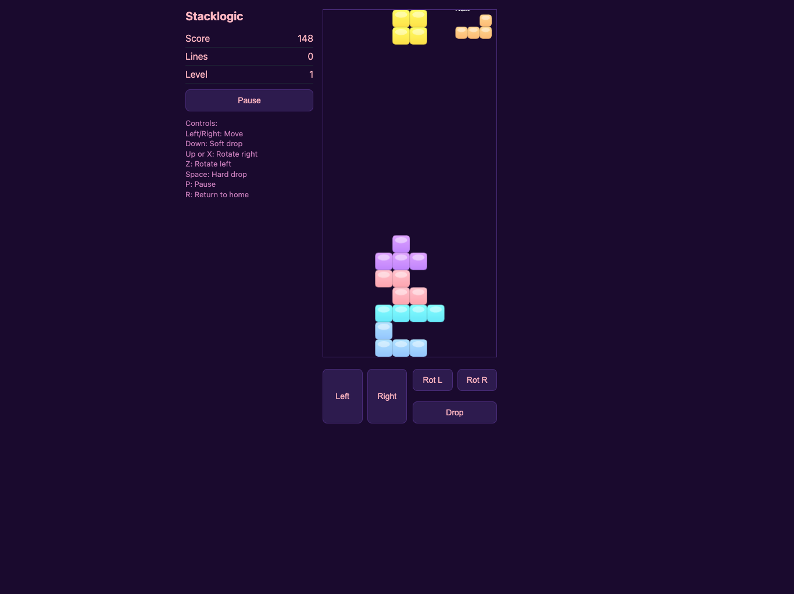

# StackLogic

**Version:** v0.2.0-beta.1

A fast-paced, block-stacking arcade puzzler with crisp controls and escalating challenge.

**Play the current release:** https://vector-sigma-works.github.io/StackLogic/

## Screenshots

### Matrix gameplay



| Pause-time theme selection | iPad-class touch controls |
| --- | --- |
|  |  |

## Run locally

Prereqs: Node.js 18+ recommended.

```bash
npm install
npm start
```

Then open: http://localhost:3000

## Project layout

- `server.js` — Express server
- `public/` — client assets
- `data/` — game data / saved state (if used)

## Versioning

Current release line: **v0.x beta**.

- **Beta** means: gameplay + UI can change, save formats aren’t guaranteed stable, and there may be rough edges.
- **Patch** releases (v0.1.0-beta.2, beta.3, …): fixes/tweaks.
- **Minor** releases (v0.2.0-beta.1, …): new features, bigger balance/feel changes.
- **v1.0.0** target: rules/feel locked, stable saves (if applicable), and “ship-ready” polish.

## Notes

This repo is intentionally lightweight and easy to run.

## Backlog / Roadmap Notes

- See `BACKLOG.md` for parked roadmap items, review follow-ups, and handoff notes for future backlog processing.
